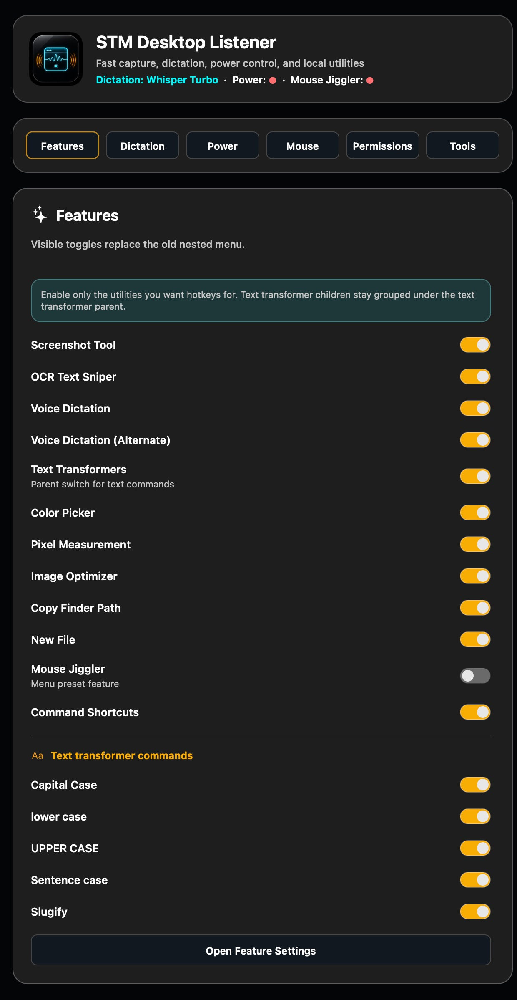
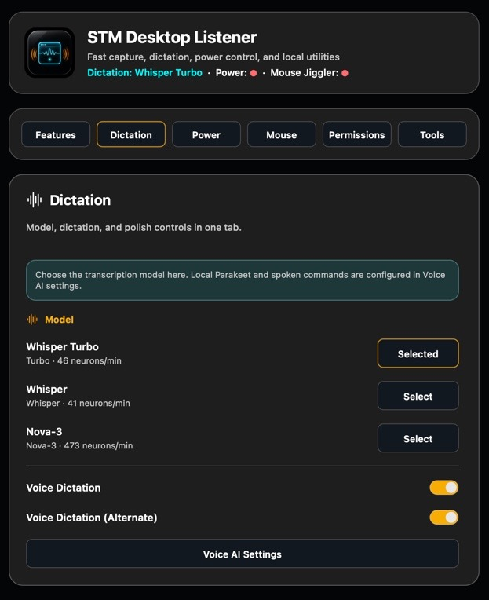
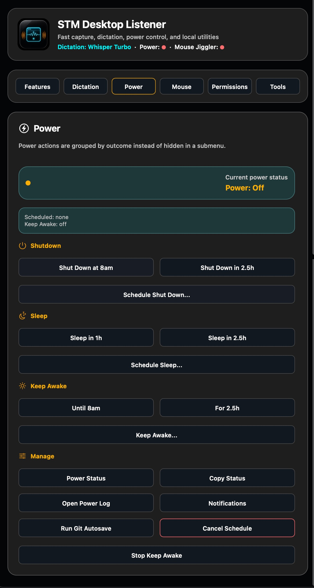
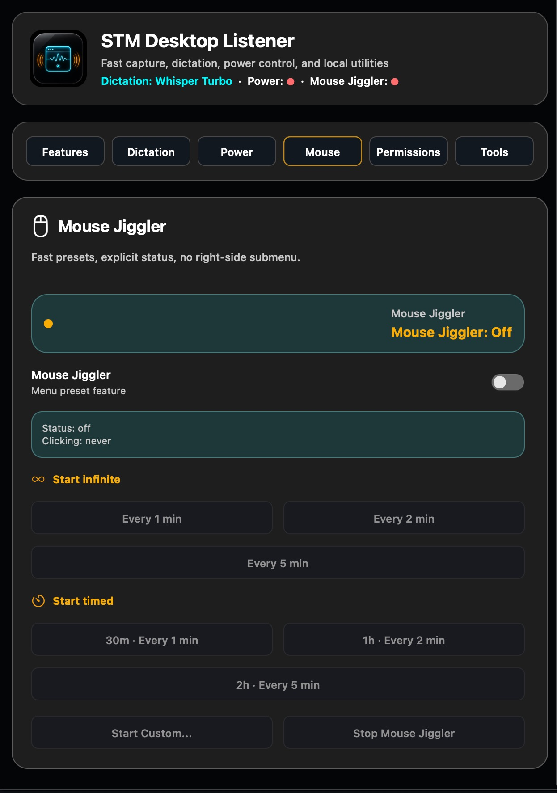
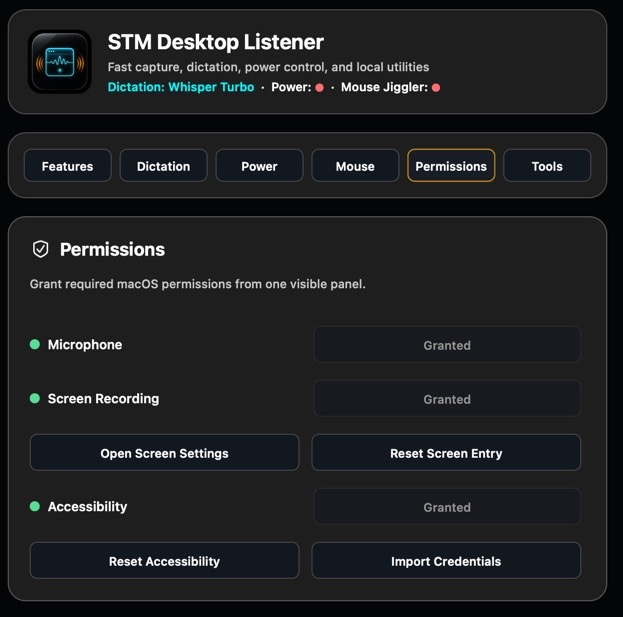
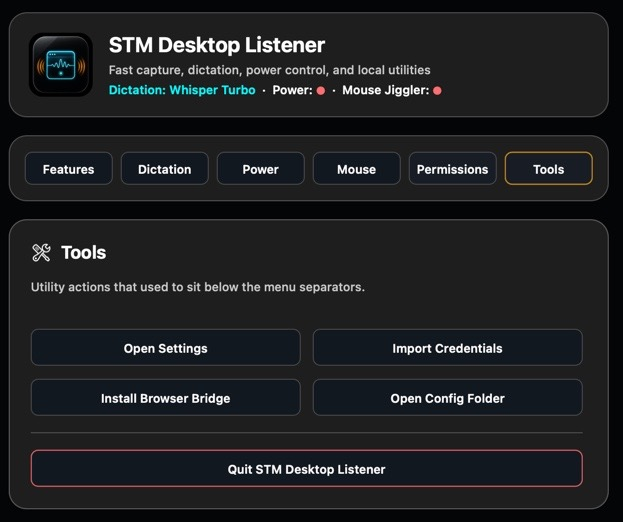

# STM Desktop Listener for Mac

## Your fastest Mac actions, one shortcut away

STM Desktop Listener puts capture, dictation, text cleanup, power controls, and practical Mac utilities in one focused menu bar app. Choose the tools you use, give them memorable shortcuts, and turn repetitive desktop work into a single key press.

It began as a companion app for SEO Time Machines, then grew into an independent Mac toolbelt that anyone can use. No SEO Time Machines account or app is required.

[Download the latest precompiled release](https://github.com/demetre19/STM-Desktop-Listener-Releases/releases/latest)



## Spend less time switching apps

### Capture, mark up, and move on

Take a region screenshot and open it instantly in the native editor. Add arrows, text, numbers, blur, crops, and export-ready finishing touches without breaking your flow or opening a browser tab.

### Pull text out of anything on screen

Turn screenshots, locked PDFs, videos, and image-only text into editable copy. OCR Text Sniper gives you the words you need without retyping them.

### Speak at the speed of thought

Dictate anywhere on your Mac with a primary and alternate shortcut. Choose fast cloud transcription or private local Parakeet, then keep working with clean punctuation and capitalization.



### Fix text before it slows you down

Select text and turn it into Capital Case, lowercase, UPPER CASE, sentence case, or a clean URL slug. Text Transformers remove the copy, edit, and paste routine from everyday writing.

### Copy the exact Finder path instantly

Stop dragging files into Terminal or hunting through folder names. One Finder-only shortcut copies the selected file or folder path, ready for Terminal, scripts, support messages, or documentation.

### Run trusted Terminal commands from a shortcut

Save the commands you use repeatedly and trigger each one with its own recorded shortcut. Restart a local service, run a maintenance command, or launch a familiar workflow without reopening Terminal and typing it again.

### Sample any colour with confidence

Point at any desktop pixel and copy its exact sRGB hex value. Match interfaces, graphics, and brand colours without taking a screenshot first.

### Measure once, build accurately

Drag across any part of the screen to get its dimensions in points and physical pixels. Check spacing, assets, and layouts without guessing.

### Send images straight to optimisation

Move Finder-selected or clipboard images into your existing browser optimiser with one shortcut. The handoff is immediate, so smaller assets do not require a manual upload routine.

### Control power without watching the clock

Schedule shutdown or sleep, keep the Mac awake for a task, and see the current state at a glance. Before a scheduled shutdown, STM can save dirty Git repositories discovered from open cmux or OMP sessions.



### Keep presence active without accidental clicks

Move the pointer at a safe interval for a fixed duration or until you stop it. Mouse Jiggler never clicks, types, drags, or scrolls.



### See every permission in one place

Check Microphone, Screen Recording, and Accessibility access without searching through macOS settings. Open or reset the right permission from one clear panel.



### Keep essential utilities close

Open settings, import credentials, install the browser bridge, reach the config folder, or quit the app from one compact Tools tab.



## Choose only the tools you want

Enable the features that belong in your workflow and leave the rest off. Each enabled utility stays easy to find in the menu bar, while shortcut controls live together in Settings.

## App identity

- App: `STM Desktop Listener.app`
- Bundle ID: `com.seotimemachines.stm-desktop-listener`
- Config: `~/Library/Application Support/STM Desktop Listener/config.json`
- Logs: `~/Library/Logs/STM Desktop Listener/debug.log`
- Native host name: `com.stm.desktop_listener`
- Minimum macOS: 14.0 on Apple silicon

For normal use, open `/Applications/STM Desktop Listener.app`. The project folder contains source files and scripts. The packaged app, ZIP, and DMG are in `dist/`.

## Prerequisites

STM Desktop Listener builds as a native Swift and AppKit macOS application. It does not use Electron, a web wrapper, or an Xcode project.

You need:

- A Mac running macOS 14 or later.
- Apple silicon for the currently bundled ONNX Runtime. The build script retains a universal-build path for a future matching Intel runtime, but the current output is arm64.
- Apple Command Line Tools, installed with `xcode-select --install`. The full Xcode app is not required.
- The complete repository checkout, including the reviewed libraries under `Vendor/` and model resources under `Resources/`.
- Administrator permission only if your account cannot replace the app in `/Applications`.
- Microphone, Screen Recording, and Accessibility permission when you use the features that need them.

Cloudflare credentials are optional when you use local Parakeet transcription. Brave or Chrome plus the STM extension is needed only for scrolling-capture and image-optimiser bridge workflows.

## Precompiled downloads and release channels

Precompiled downloads are published as GitHub Releases in [`demetre19/STM-Desktop-Listener-Releases`](https://github.com/demetre19/STM-Desktop-Listener-Releases/releases). The private source repository is not mirrored there; the public channel contains only release notes, precompiled packages, and checksums.

[Download the latest precompiled release](https://github.com/demetre19/STM-Desktop-Listener-Releases/releases/latest)

Each published version provides:

- `STM-Desktop-Listener-Mac-arm64-v<version>.dmg`
- `STM-Desktop-Listener-Mac-arm64-v<version>.zip`
- `SHA256SUMS.txt`

Download the checksum manifest beside the DMG or ZIP and verify it before opening the package:

```bash
shasum -a 256 -c SHA256SUMS.txt
```

Both stable releases and explicitly marked prereleases are eligible for update notifications; draft releases are excluded because they are not public. The app checks quietly no more than once per day and also supports a manual check. It can download and verify the exact arm64 DMG, but it never installs or replaces the app automatically.

Initial packages are ad hoc signed rather than Apple-notarized. They support macOS 14 or later on Apple silicon and may show macOS publisher or quarantine warnings.

## Build

```bash
./build.sh
```

Output:

```text
dist/STM Desktop Listener.app
```

## Install

```bash
./install.sh
```

The installer builds the app, copies it to `/Applications/STM Desktop Listener.app`, installs the native messaging host manifest for Chrome and Brave, removes quarantine, and opens the app.

## Package

```bash
./package.sh
```

Output:

```text
dist/STM-Desktop-Listener-Mac-arm64-v<version>.zip
dist/STM-Desktop-Listener-Mac-arm64-v<version>.dmg
```

## Credentials

Choose **Import Credentials** in the menu bar app or in Settings. The app opens a detailed Cloudflare Worker setup guide with:

- Worker Name, Worker URL, and Transcription Auth Token fields.
- The existing shared transcription token to save as `JITSI_TRANSCRIBE_AUTH_TOKEN`.
- Copy buttons for Wrangler commands.
- A link to the full STM Chrome extension Worker guide.
- A JSON template that updates from the values you type.
- A **Choose JSON** button that imports the credentials file into this app.

Create a JSON file named something like `stm-desktop-listener-credentials.json`:

```json
{
  "workerUrl": "https://share.seo-time-machines.workers.dev",
  "authToken": "your-transcription-auth-token",
  "cloudflareAccountId": "optional-for-live-credit-count",
  "cloudflareApiToken": "optional-cloudflare-api-token-with-workers-ai-read",
  "extensionId": "phhmonggcijfgpcenlbhaeoepiadnpjj",
  "browserBundleId": "com.brave.Browser"
}
```

`workerUrl` and `authToken` are required only when **Cloudflare Worker** is selected as the transcription engine. The `authToken` value must match `JITSI_TRANSCRIBE_AUTH_TOKEN`, not the shared Worker's main `AUTH_TOKEN`. `extensionId` and `browserBundleId` are optional bridge settings.

For production, `workerUrl` must remain `https://share.seo-time-machines.workers.dev`.

Import the file from **Import Credentials > Choose JSON**.

### HTTP 401 transcription-token recovery

`HTTP 401: Unauthorized: Invalid auth token` means the Worker is reachable but its write-only `JITSI_TRANSCRIBE_AUTH_TOKEN` secret does not exactly match the app's saved `authToken`.

Handle it in this order:

1. Read `~/Library/Application Support/STM Desktop Listener/config.json` without printing the token. Confirm the `workerUrl`, token length, absence of leading/trailing whitespace, file mode `0600`, and a short SHA-256 prefix.
2. Compare that metadata with another working transcription client. Desktop Listener and Jitsi clients using the same Worker must use the exact same transcription token.
3. If the clients agree but the Worker returns 401, run Wrangler only from the canonical `GMB-Extractor/worker-setup` checkout and feed the shared transcription token to `wrangler secret put JITSI_TRANSCRIBE_AUTH_TOKEN` through standard input. Cloudflare secrets are write-only, so they cannot be read back for comparison.
4. Verify recovery by uploading a real WAV to `/api/transcribe` with the saved bearer token. Success requires HTTP 200 and non-empty transcript text.

Do **not** generate a replacement token on one computer, overwrite the main `AUTH_TOKEN`, change `workerUrl`, deploy from STM Desktop Listener or STM Recorder, edit the canonical Worker authentication logic, change R2/Workers AI bindings, or alter chunking or audio settings. Do not put the token in command arguments, terminal output, logs, screenshots, source files, or committed credentials. The production URL is immutable, and transcription secret changes must run only from the canonical GMB `worker-setup` directory.

## Voice AI

Open **Settings > Voice AI** to choose cloud or local transcription and configure safe spoken shortcuts.
Every dictation uses the bundled local Edge-Punct-Casing model after speech recognition. STM accepts its punctuation and capitalization only when the case-insensitive sequence of every letter and number token is unchanged. A candidate that adds, removes, changes, or reorders words is rejected; existing acronyms and mixed-case names keep their original casing. The transcript is never sent to a general chat model.


### Local Parakeet transcription

- Choose **Local Parakeet** to keep speech recognition on the Mac; Worker credentials are not required.
- **Use Orca Model** reuses Orca's existing `parakeet-tdt-0.6b-v3-int8` files without copying them.
- **Download Parakeet** installs the same model into STM Desktop Listener's Application Support folder after verifying the published archive SHA-256.
- Parakeet supplies punctuation and capitalization directly.
- Optional spoken commands accept only `command <saved shortcut title>` or `run command <saved shortcut title>`. Matching is exact after case and punctuation normalization; dictated shell text is never executed.

The Parakeet model is NVIDIA Parakeet TDT 0.6B v3 int8 under CC-BY-4.0. The bundled sherpa-onnx runtime is Apache-2.0, and ONNX Runtime is MIT licensed. Runtime notices are included in the app bundle; downloaded models include an attribution file. The bundled Edge-Punct-Casing model's source URL and verified archive/model hashes are recorded in `Resources/PunctuationModel/MODEL_METADATA.txt`.

### Cloudflare Worker transcription

The Cloudflare Worker sends recorded audio to the selected speech-to-text model. It returns that model's transcript directly; STM does not send the text to a general chat model or accept generated replacement wording.

If you do not have credentials yet:

1. Sign up for Cloudflare.
2. Install Node.js.
3. Install Wrangler and log in with `wrangler login`.
4. Open the canonical `GMB-Extractor/worker-setup` checkout.
5. Create the R2 bucket used by the shared STM Worker with `wrangler r2 bucket create stm-recorder-videos`.
6. Deploy the Worker only from that canonical directory with `wrangler deploy`.
7. Add the transcription token with `wrangler secret put JITSI_TRANSCRIBE_AUTH_TOKEN`.
8. Keep `https://share.seo-time-machines.workers.dev` as the Worker URL, paste the transcription token into the JSON template, save it, then import it.

## Permissions

macOS permissions are per app bundle ID and signing identity, so this app gets its own entries in System Settings.

- Microphone: required for dictation.
- Screen Recording: required for screenshots, OCR, color picking, and pixel measurement.
- Accessibility: required for autopaste and selected text fallback.

Use **Permissions** in the menu bar item to check status and open the relevant System Settings pages.

From Terminal, you can request and open the Screen Recording pane with:

```bash
'/Applications/STM Desktop Listener.app/Contents/MacOS/STM Desktop Listener' --request-screen-permission --open-screen-settings
```

## Shortcuts

Open the menu bar item, then choose **Open Settings > Features**.

Each feature row has:

- Enabled: controls whether the feature can launch.
- Current Shortcut: shows the active desktop hotkey.
- Set: records the next key combination you press.
- Clear: disables that feature's global hotkey.
- Default: restores the desktop listener default.
- Chrome Default: applies the known Chrome extension default where one exists.

Normal Voice Dictation may use the plain `Home` key. Other recorded shortcuts, including Voice Dictation (Alternate), must include Command or Control so they remain compatible with macOS global hotkey registration.

Copy Finder Path appears in the same feature list and uses the same shortcut recorder. Its default is `Cmd+Alt+C`, and the listener only registers it while Finder is frontmost so it does not interfere with browser shortcuts.

Voice Dictation (Alternate) defaults to `Ctrl+Alt+D`.

## Mouse Jiggler

Open the menu bar item, then choose **Mouse Jiggler**. The feature is disabled by default; enable it either in **Features > Mouse Jiggler** or from the Mouse Jiggler dropdown.

- Infinite presets: move every **1 min**, **2 min**, or **5 min**.
- Timed presets: run for **30 min**, **1 hour**, or **2 hours**.
- **Start Custom...** lets you choose the interval and whether it runs forever or stops later.
- **Stop Mouse Jiggler** turns movement off.

Mouse Jiggler only posts `mouseMoved` events. It never clicks, drags, scrolls, or types.

## Power controls

Open the menu bar item, then choose **Power**. The Power menu title shows the current state, for example `Power: Shutdown 8:00 / Awake`.

- **Status...** shows the scheduled action, keep-awake end time, autosave rules, and log path.
- **Copy Status** copies the same status text to the clipboard.
- **Open Power Log** opens `~/Library/Logs/STM Desktop Listener/debug.log`.
- **Open Notification Settings** opens macOS notification settings so STM Desktop Listener banners can be allowed if macOS denied them.
- Presets such as **Shut Down at 8am**, **Shut Down in 2.5h**, **Sleep in 1h**, and **Keep Awake until 8am** run immediately from the menu.
- **Schedule Shut Down...** accepts typed inputs like `8am`, `23:30`, `2.5h`, or `30m`.
- **Schedule Sleep...** uses the same time input.
- **Keep Awake...** uses macOS `caffeinate` to prevent display, idle, system, and user inactivity sleep until the duration expires.
- **Run Git Autosave Now** commits dirty git repos discovered from open cmux/OMP session process trees.
- **Cancel Scheduled Power Action** removes this app's scheduled shut down/sleep LaunchAgent.
- **Stop Keep Awake** stops this app's keep-awake LaunchAgent.

Scheduled shutdown runs inside this app with `--power-runner shutdown`. Before shutting down, it stages and commits dirty git repos it can discover from open cmux/OMP session process trees. It skips repos in merge, rebase, cherry-pick, or revert states. It does not push, and it cannot save unsaved editor buffers, browser tabs, or non-git work.

Successful menu actions also post macOS notifications when notifications are allowed for STM Desktop Listener.

The same bundled listener binary can be called from Terminal for automation:

```bash
'/Applications/STM Desktop Listener.app/Contents/MacOS/STM Desktop Listener' --power-schedule shutdown 8am
'/Applications/STM Desktop Listener.app/Contents/MacOS/STM Desktop Listener' --power-schedule sleep 2.5h
'/Applications/STM Desktop Listener.app/Contents/MacOS/STM Desktop Listener' --keep-awake 2.5h
'/Applications/STM Desktop Listener.app/Contents/MacOS/STM Desktop Listener' --power-status
```

## Native screenshot editor

Standard region captures open directly in the native editor, so no browser tab is created or activated. The editor includes Arrow (`A`), Line (`L`), Text (`T`), Box (`B`), Number (`1`), Blur (`R`), Pixelate (`P`), Crop (`C`), Magnifier (`M`), and Backdrop (`K`). Use `Shift`+`+`/`-`/`0` for zoom, `-`/`=` for stroke width, `[`/`]` for fill opacity, `Return` to apply a crop, `Delete` to remove the selection, and `Cmd`+`Z`/`C`/`S` for undo, copy, and save.

PNG, JPEG, and WebP output, JPEG/WebP quality, clipboard shrink, and the browser-compatible maximum visual width are available in the toolbar. The editor automatically fits each capture within the available viewport and remembers its window size and position. Backdrops support solid colors, editable linear or radial gradients with two to eight stops and saved presets, or a repositionable blurred image.

## Browser bridge

Scrolling captures and image-optimizer payloads are stored by the native app as short-lived temp payloads. The STM extension requests chunks by token through the native messaging host. Standard screenshots stay in the native editor. This avoids the 1 MB host-to-extension message limit for the remaining bridged workflows.

Install or refresh the host manifest manually with:

```bash
./install-native-host.sh phhmonggcijfgpcenlbhaeoepiadnpjj
```

## Troubleshooting

- No menu bar icon: open `/Applications/STM Desktop Listener.app` manually.
- A feature says disabled: enable it under **Features** first.
- Screenshot or OCR fails: grant Screen Recording permission, then quit and reopen the app.
- Repeating display flash: do not assume the foreground app owns it. Check for a third-party input or display driver that is repeatedly crashing and being restarted. See [Display Flashing and Legacy Driver Crash Loops](DISPLAY-FLASHING-DRIVER-INCIDENT.md) for the incident evidence, safe driver guidance, and controlled test sequence.
- Dictation fails: import credentials, then test dictation again. Long recordings use a first 60-second, 16 kHz mono Worker request, then 20-second follow-up chunks with up to two uploads in flight while you keep talking; Cloudflare 1102 resource-limit responses are automatically retried by splitting the failed audio into smaller pieces. Set `dictationChunkSeconds` to `10` or `5`, or set `dictationUploadConcurrency` to `1`, in config.json if a Worker still cannot finish.
- Autopaste fails: grant Accessibility permission. Copy-first behavior still works without it.
- Scrolling editor or image optimizer does not open: confirm the STM extension ID matches `extensionId` in config and reinstall the native host manifest.

## Screenshot capture behavior

The screenshot tool freezes the visible displays into an in-process snapshot before showing the selection overlay, then crops the selected region locally. Standard screenshots do not open a browser tab or launch a screenshot helper process. The selection overlay and native editor are closed and released after use. Transient hover states, menus, or tooltips may close when the overlay receives focus.
